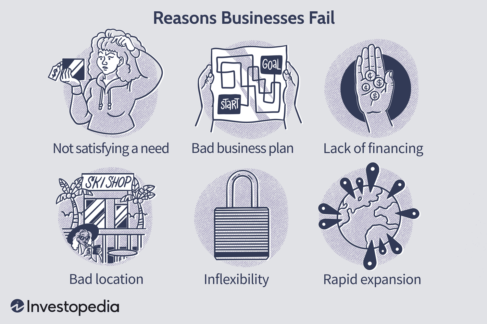

# BroGrow-Backend

Bro-Grow is a business icubator Android App which enables entrepreneurs to make smart business decisions based on micro-market.

## Problem Statement

- According to Investopedia bad location is one of the major reasons why a business fails.
- Organic foot traffic is important for business growth.
- Too little financing that is low capital or if you misevaluate the amount of loan (too high or too low) can ruin your business.

## Our Solution

Our app creates insights into the location where you want to open a business using various micro-market metrics. We are using various sources to ensure the business gets accurate and important information in their hand.

- Web scrape the sector trends and check if the business will thrive or not.
- EDA (Exploratory Data Analysis) on the [PhonePE Pulse data](https://github.com/PhonePe/pulse) to check location specific payment habit.
- Competition in the surrounding location (Similar Businesses in the area) obtained from Google's Places API.
- Better Oppurtunities in surrounding district, if available.
- Evaluate the loan on the basis of credit score from the user based on the ML Model and the SETU API.
- Check Organic Foot Traffic in the Area by calculatin the spending habit of the area.
- Sentiment Analysis on business's google reviews in the 5km region of the location. 
- SMS Based Authentication for easier access to all demographics in India.

## Pictures

### Start Page with SMS Authentication

### Home Page

### SETU-API to fetch Transaction Details and Calculate CIBIL Score

